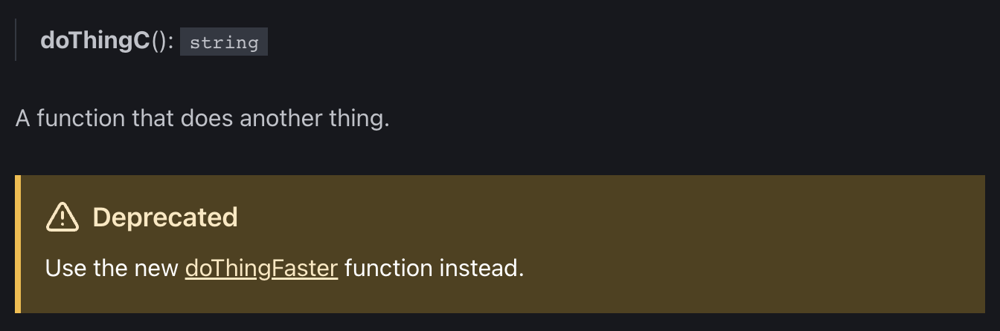

import { Tabs, TabItem } from '@astrojs/starlight/components'

A [Starlight](https://starlight.astro.build) plugin using [TypeDoc](https://typedoc.org) and [typedoc-plugin-markdown](https://github.com/tgreyuk/typedoc-plugin-markdown) to generate documentation from TypeScript code.

Check out the [example](https://starlight-typedoc-example.vercel.app) for a preview of the generated documentation.

Some [TSDoc](https://tsdoc.org) tags uses a custom Markdown syntax, e.g. the `@deprecated`, `@alpha`, `@beta` and `@experimental` tags using Starlight [asides](https://starlight.astro.build/guides/authoring-content/#asides):



## Install the plugin

Starlight TypeDoc is a Starlight [plugin](https://starlight.astro.build/reference/plugins/). Install it and its peer dependencies using your favorite package manager:

<Tabs>
<TabItem label="npm">

```sh
npm install starlight-typedoc typedoc typedoc-plugin-markdown@next
```

</TabItem>
<TabItem label="pnpm">

```sh
pnpm add starlight-typedoc typedoc typedoc-plugin-markdown@next
```

</TabItem>
<TabItem label="Yarn">

```sh
yarn add starlight-typedoc typedoc typedoc-plugin-markdown@next
```

</TabItem>
<TabItem label="Bun">

```sh
bun add starlight-typedoc typedoc typedoc-plugin-markdown@next
```

</TabItem>
<TabItem label="ni">

```sh
ni starlight-typedoc typedoc typedoc-plugin-markdown@next
```

</TabItem>
</Tabs>

:::note
The Starlight TypeDoc package requires at least the version `4.0.0-next.45` of `typedoc-plugin-markdown`, hence the `@next` tag in the installation command.
:::

## Add the plugin

The Starlight TypeDoc plugin can be added to your Starlight [configuration](https://starlight.astro.build/reference/configuration/#plugins) in the `astro.config.mjs` file:

```diff lang="js"
// astro.config.mjs
import starlight from '@astrojs/starlight'
import { defineConfig } from 'astro/config'
+import starlightTypeDoc, { typeDocSidebarGroup } from 'starlight-typedoc'

export default defineConfig({
  integrations: [
    starlight({
+      plugins: [
+        // Generate the documentation.
+        starlightTypeDoc({
+          entryPoints: ['../path/to/entry-point.ts'],
+          tsconfig: '../path/to/tsconfig.json',
+        }),
+      ],
      sidebar: [
        {
          label: 'Guides',
          items: [{ label: 'Example Guide', link: '/guides/example/' }],
        },
+        // Add the generated sidebar group to the sidebar.
+        typeDocSidebarGroup,
      ],
      title: 'My Docs',
    }),
  ],
})
```

The Starlight TypeDoc plugin behavior can be tweaked using various [configuration options](/configuration).
